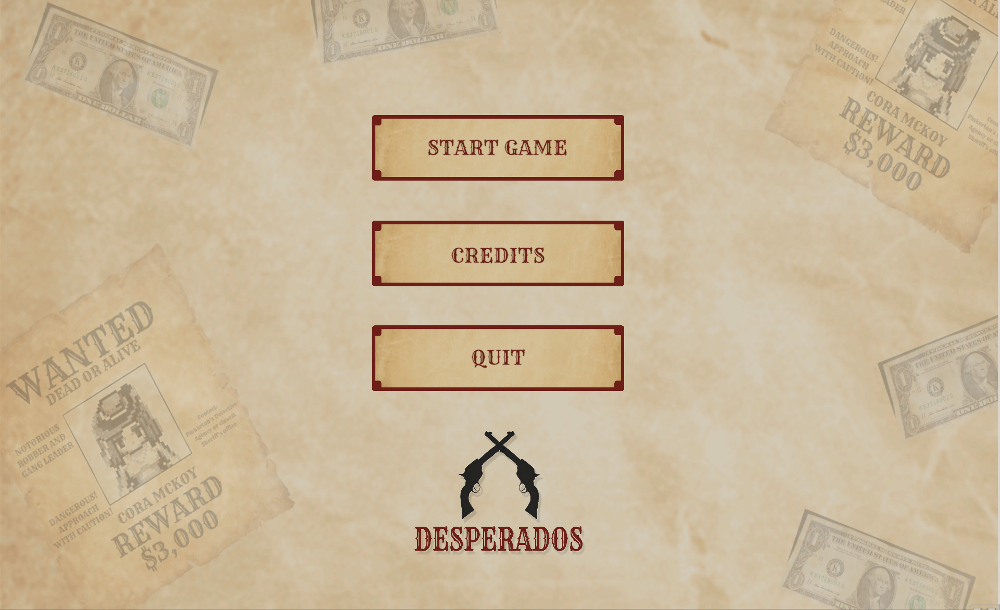
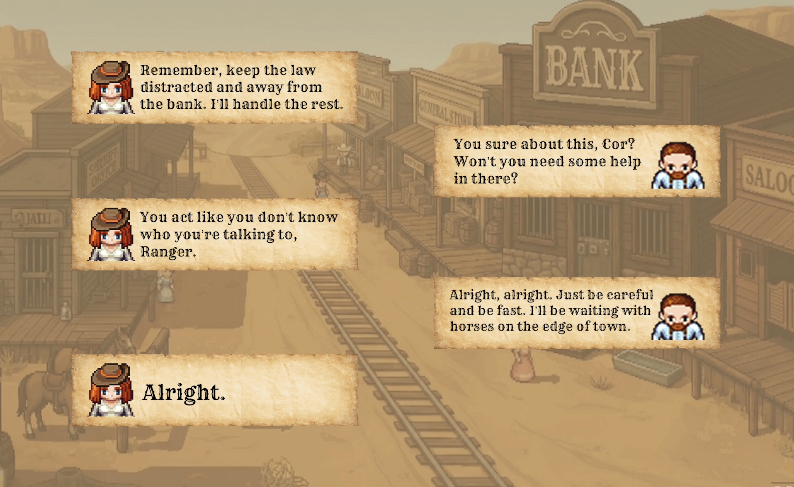
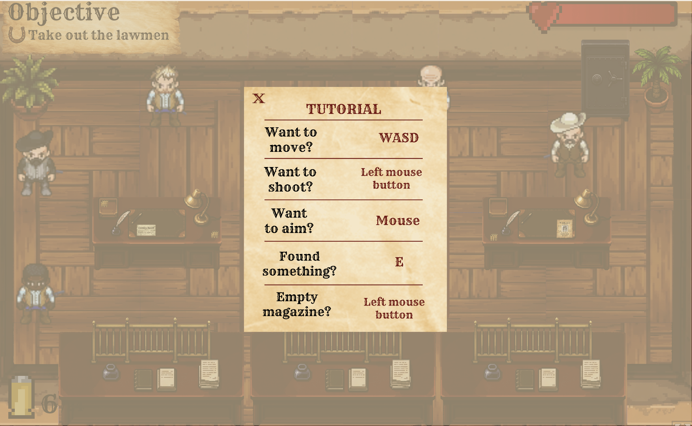

# DESPERADOS — UI/UX


> *Game UI/UX design created for Desperados, a short Wild West shootout game built in Unity.*

## 🎮 About the Project

**Desperados** is a short Wild West game centered around **Cora McKoy**, an outlaw carrying out a bank robbery.

This repository focuses specifically on the **UI/UX design and visual interface work** created for the game.

The UI was designed in **Figma** and then implemented in **Unity**, with the goal of creating a cohesive interface that fits the game's Wild West setting while keeping important gameplay information clear and accessible.

---
## 📸 Screenshots

### Main Menu



### Dialogue


 
### Tutorial Popup & Gameplay HUD



---

## 🎨 UI/UX Design

The project includes UI for the complete game flow, including:

* Main Menu
* Tutorial
* Objectives
* Health HUD
* Ammunition HUD
* Reloading feedback
* Interaction prompts
* Dialogue
* Safe loot feedback
* Secret discovery
* Failed / Death screen
* Job Completed screen
* Credits

The interface was designed around **clarity, visual hierarchy, feedback, and consistency**, while maintaining the game's Wild West visual identity.

---

## 🧭 UI Flow

```text
Title Card
    ↓
Main Menu
    ↓
Intro Dialogue
    ↓
Tutorial
    ↓
Gameplay
 ├── Objectives
 ├── Health
 ├── Ammunition
 ├── Interactions
 ├── Secret Discovery
 └── Safe Loot
    ↓
Ending Dialogue
    ↓
Job Completed
    ↓
Escape Sequence
    ↓
Credits
```

---

## 🖥️ Design Highlights

### Main Menu

Designed to establish the visual identity of the game immediately while keeping navigation simple and readable.

### Dialogue

Dialogue screens were designed to support the game's characters and story without taking the player completely out of the game world.

### Gameplay HUD

The HUD provides the player with essential information such as:

* Current health
* Ammunition
* Current objectives
* Interaction prompts
* Gameplay feedback

### Objective System

Objectives are presented clearly so the player always understands the current goal without overwhelming the screen.

### Interaction Feedback

Interactive objects receive visual feedback when the player approaches them, making important interactions easier to identify.

### Reward Feedback

Looting the safe provides immediate visual feedback through a combination of:

* Reward animation
* Loot notification
* Money feedback
* Objective completion

### Job Completed Screen

The completion screen summarizes the player's performance, including:

* Safe loot status
* Enemies killed
* Secrets discovered

---

## 🛠️ Tools

* **Figma** — UI/UX design and prototyping
* **Unity 6** — UI implementation
* **C#** — UI systems and interaction logic
* **Git** — Version control

---

## 👩‍💻 My Role

This UI was designed and implemented independently as part of the **Desperados** game project.

**Responsibilities:**

* UI/UX Design
* Interface Design
* Visual Hierarchy
* Interaction Design
* UI Implementation
* Player Feedback
* UI Testing

---

## 🎮 Play Desperados

The complete game is available to play on itch.io:

**[▶ Play Desperados](https://sarii24.itch.io/desperados)**

---

## 🔗 Related Project

The complete Unity project, including gameplay systems and UI implementation, can be found here:

**[View the Desperados Unity Project](https://github.com/saraonhub/Desperados)**

---

## 📄 About

**Desperados** was created as a personal portfolio project to explore game development with a particular focus on **UI/UX, player feedback, and game flow**.

**Created by Sara Popović · 2026**
